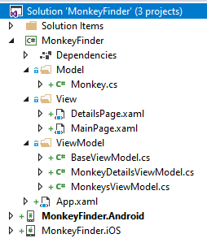
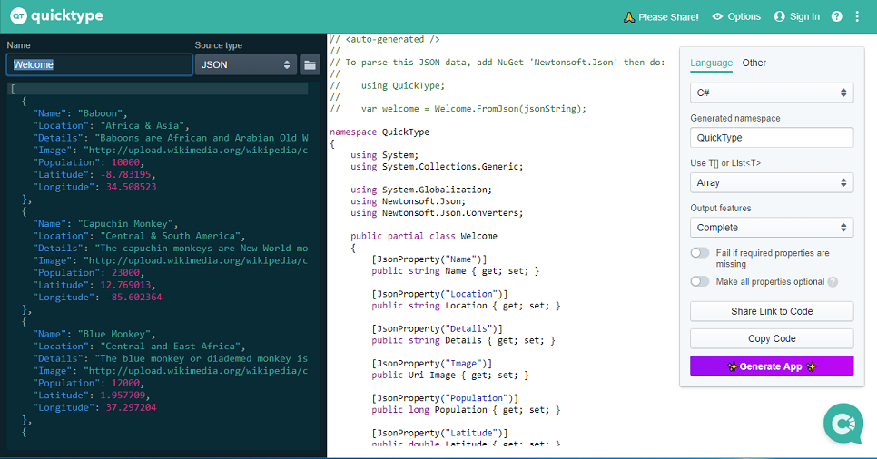
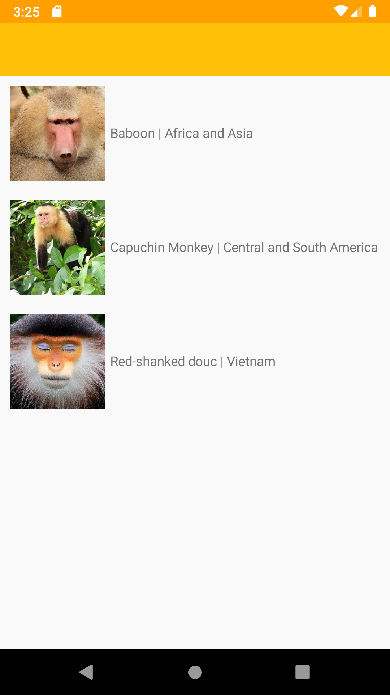

## Displaying Data

In Part 1 we will go over what makes up a Xamarin.Forms project and how to display a list of data in a list.

### Open Solution in Visual Studio

1. Open **Part 1 - Displaying Data/MonkeyFinder.sln**

This MonkeyFinder contains 3 projects:

* MonkeyFinder  - Shared .NET Standard project that will have all shared code (model, views, view models, and services)
* MonkeyFinder.Android - Xamarin.Android application
* MonkeyFinder.iOS - Xamarin.iOS application (requires Visual Studio for Mac or a macOS build host)



The **MonkeyFinder** project also has blank code files and XAML pages that we will use during the Hands on Lab. All of the code that we modify will be in this project for the workshop.

### NuGet Restore

All projects have the required NuGet packages already installed, so there will be no need to install additional packages during the Hands on Lab. The first thing that we must do is restore all of the NuGet packages from the internet.

1. **Right-click** on the **Solution** and select **Restore NuGet packages...**


### Model

We will be downloading details about the monkey and will need a class to represent it.

We can easily convert our json file located at [montemagno.com/monkeys.json](https://montemagno.com/monkeys.json) by using [quicktype.io](https://app.quicktype.io/) and pasting the raw json into quicktype to generate our C# classes. Ensure that you set the Name to `Monkey` and the generated namespace to `MonkeyFinder.Model` and select C#. Here is a direct URL to the code: [https://app.quicktype.io?share=W43y1rUvk1FBQa5RsBC0](https://app.quicktype.io?share=W43y1rUvk1FBQa5RsBC0)



1. Open `Model/Monkey.cs`
2. In `Monkey.cs`, copy/paste the following:

```csharp
public partial class Monkey
{
    [JsonProperty("Name")]
    public string Name { get; set; }

    [JsonProperty("Location")]
    public string Location { get; set; }

    [JsonProperty("Details")]
    public string Details { get; set; }

    [JsonProperty("Image")]
    public string Image { get; set; }

    [JsonProperty("Population")]
    public long Population { get; set; }

    [JsonProperty("Latitude")]
    public double Latitude { get; set; }

    [JsonProperty("Longitude")]
    public double Longitude { get; set; }
}

public partial class Monkey
{
    public static Monkey[] FromJson(string json) => JsonConvert.DeserializeObject<Monkey[]>(json, MonkeyFinder.Model.Converter.Settings);
}

public static class Serialize
{
    public static string ToJson(this Monkey[] self) => JsonConvert.SerializeObject(self, MonkeyFinder.Model.Converter.Settings);
}

internal static class Converter
{
    public static readonly JsonSerializerSettings Settings = new JsonSerializerSettings
    {
        MetadataPropertyHandling = MetadataPropertyHandling.Ignore,
        DateParseHandling = DateParseHandling.None,
        Converters =
        {
            new IsoDateTimeConverter { DateTimeStyles = DateTimeStyles.AssumeUniversal }
        },
    };
}
```

One key difference is that we will change:

`public Uri Image {get;set;}` to `public string Image {get;set;}`

This will allow us to more easily display data in the next step.

### Displaying Data

We can display hard coded data of any data type in a `ListView` in our `MainPage.xaml`. This will allow us to use built-in data cells such as the `ImageCell`, that will automatically display text information and images in the `ListView`. Add the following into the MainPage.xaml's `ContentPage`:

```xml
<ListView>
    <ListView.ItemsSource>
        <x:Array Type="{x:Type model:Monkey}">
            <model:Monkey Name="Baboon" Location="Africa and Asia" Image="https://upload.wikimedia.org/wikipedia/commons/thumb/9/96/Portrait_Of_A_Baboon.jpg/314px-Portrait_Of_A_Baboon.jpg"/>
            <model:Monkey Name="Capuchin Monkey" Location="Central and South America" Image="https://upload.wikimedia.org/wikipedia/commons/thumb/4/40/Capuchin_Costa_Rica.jpg/200px-Capuchin_Costa_Rica.jpg"/>
            <model:Monkey Name="Red-shanked douc" Location="Vietnam" Image="https://raw.githubusercontent.com/jamesmontemagno/app-monkeys/master/douc.jpg"/>
        </x:Array>
    </ListView.ItemsSource>
    <ListView.ItemTemplate>
        <DataTemplate x:DataType="model:Monkey">
            <ImageCell Text="{Binding Name}"
                            Detail="{Binding Location}"
                            ImageSource="{Binding Image}"/>
        </DataTemplate>
    </ListView.ItemTemplate>
</ListView>
```


### Run the App

1. In Visual Studio, set the iOS or Android project as the startup project 

2. In Visual Studio, click "Start Debugging"
    - If you are having any trouble, see the Setup guides below for your runtime platform

#### iOS Setup

If you are on a Windows PC then you will need to be connected to a macOS build host with the Xamarin tools installed to run and debug the app.

If connected, you will see a Green connection status. Select `iPhoneSimulator` as your target, and then select a Simulator to debug on.


#### Android Setup

Set the MonkeyFinder.Android as the startup project and select your emulator or device to start debugging. With help for deployment head over to our [documentation](https://docs.microsoft.com/xamarin/android/deploy-test/debugging?WT.mc_id=docs-workshop-jamont).

Running the app will result in a list of three monkeys:



